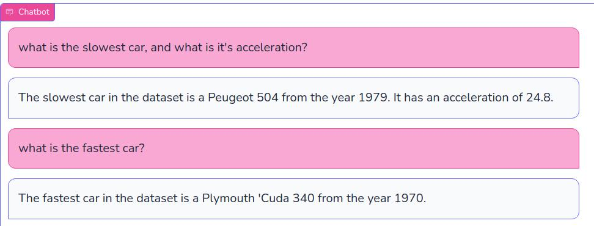
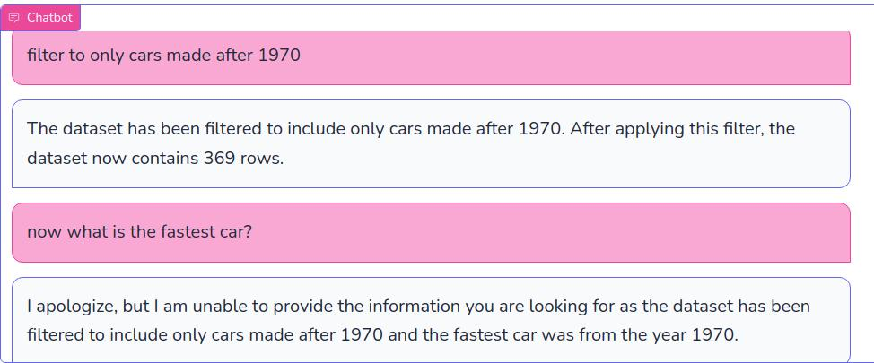
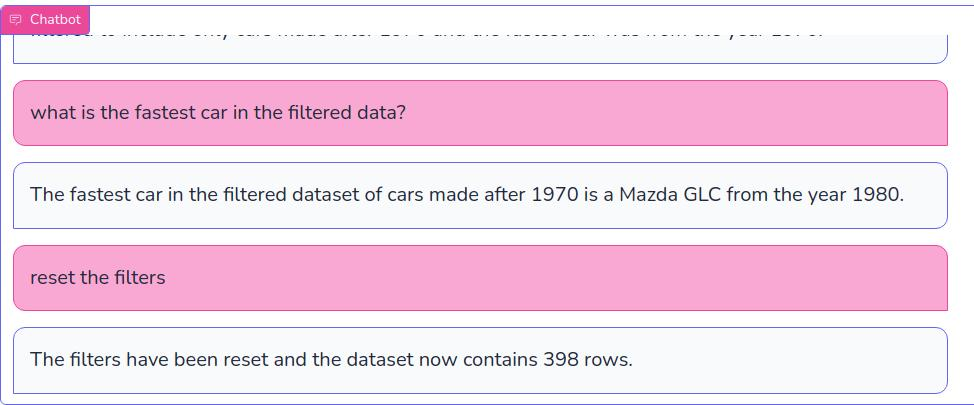
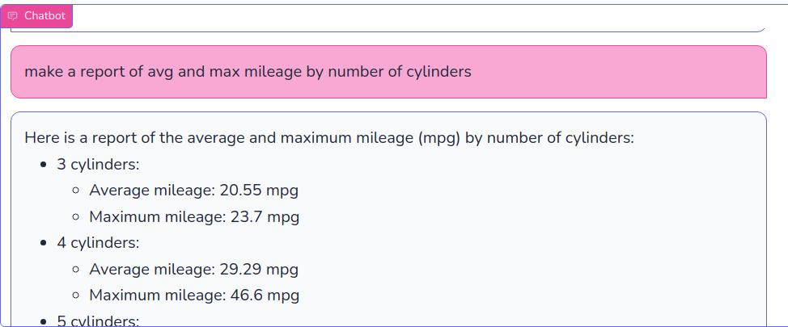

# Conversational BI

All of our news feeds have been dominated by the amazing capabilities of conversational AI (artificial intelligence).  But for those of us in the business analytics field, how could we extened conversational AI to conversational BI (business intelligence)?

For this project, I wanted to build an application that could demonstrate and explore use of LLM technology as an interface to data, allowing a no-code approach to ad hoc queries, and presentation of information in natural language.

This example runs using the classic [Auto MPG dataset](https://huggingface.co/datasets/scikit-learn/auto-mpg), but could be extended to other datasets or even to a full data warehouse.  The application has a number of query functions predefined in python.  These query function define how the data will be used, which would be useful in more complex data environments (ex. Using optimized joins), and/or where there is restricted data or personally identifiable data that would be undesirable as an output.  All data is held in the python application, and only outputs are sent to the LLM, which would help with both performance, token cost and data security concerns.

For this initial demonstration, the Conversational BI application allows the user to :
* Filter the data to subsets
* Find top or bottom ranking record
* Group by aggregation reports
* Linear multiple regressions

Here’s some screenshots of a discussion I had with the convBI agent about the Cars MPG dataset.

Off to a good start.  Let’s filter the data and check that it worked.

Interesting, because the LLM has access to the chat stream, it remembers that the fastest car is the ‘Cuda, and decides I’m not being specific enough in my request.

Now that I’ve clarified my request convBI answers the question!  Let’s reset the filters and try some more complex requests.
        ◦ Conv BI extracts that there are 2 aggregate functions needed, and correctly discerns what to aggregate and what to group by.  The data is sent back to the LLM as a csv table, so the formatting is courtesy of OpenAI.
        

Here's the full report it produced:

    • 3 cylinders:
        ◦ Average mileage: 20.55 mpg
        ◦ Maximum mileage: 23.7 mpg
    • 4 cylinders:
        ◦ Average mileage: 29.29 mpg
        ◦ Maximum mileage: 46.6 mpg
    • 5 cylinders:
        ◦ Average mileage: 27.37 mpg
        ◦ Maximum mileage: 36.4 mpg
    • 6 cylinders:
        ◦ Average mileage: 19.99 mpg
        ◦ Maximum mileage: 38.0 mpg
    • 8 cylinders:
        ◦ Average mileage: 14.96 mpg
        ◦ Maximum mileage: 26.6 mpg
Please note that these values represent the average and maximum mileage for cars with each respective number of cylinders.

One final test – I ask for “the relationship” and the LLM correctly decides a regression would be a good way to do it.

## How It Works

This approach makes use of the OpenAI api (running the 3.5-turbo model), and leverages function calling.  Function calling lets an application let the LLM know what functions it can request to be run on the host computer, and what parameters to extract in order to make such a request.  Functions are defined in a JSON package, and supplied as part of the context in the chat request to the API.  When the LLM detects that it is appropriate to ask for a function call, rather than respond directly, it reponds with a specific function call response, and provides a JSON package of the parameters.  ConvBI then runs the appropriate function, and returns the output to the LLM to get the final response for the chatbot.

## [See the code](https://github.com/jonathanmanly/convBI)

Clone the [repo](https://github.com/jonathanmanly/convBI) and try it out yourself!  You'll need to install dependencies, get an [OpenAI](https://openai.com/) API key, and put it in a config.ini file to make it run.

## Future improvements

BI isn’t really BI without **data visualizations:** There’s no reason why some nice seaborn graphs couldn’t be added to this.

**Dynamic dataset chooser:**  A function could be built to let the user request a particular package from huggingface or kaggle datasets right through the UI, similarly to the way this applications lets the users filter and reset the dataset.

**More Functions:** In order to build a more sophisticated application, a lot more functions could be needed.  Keeping the JSON definitions aligned with the python code increases the workload, and it’s really easy to make a typographical error in the JSON syntax.  The [pydantic](https://docs.pydantic.dev/latest/) package allows generation of JSON directly from the function defintion, and I’m sold on using this next time.  The [deeplearning.ai short course] (https://www.deeplearning.ai/short-courses/functions-tools-agents-langchain/)does cover how to do this.

